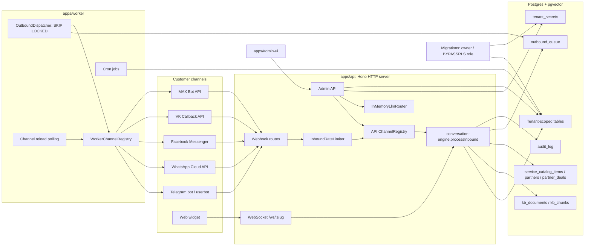
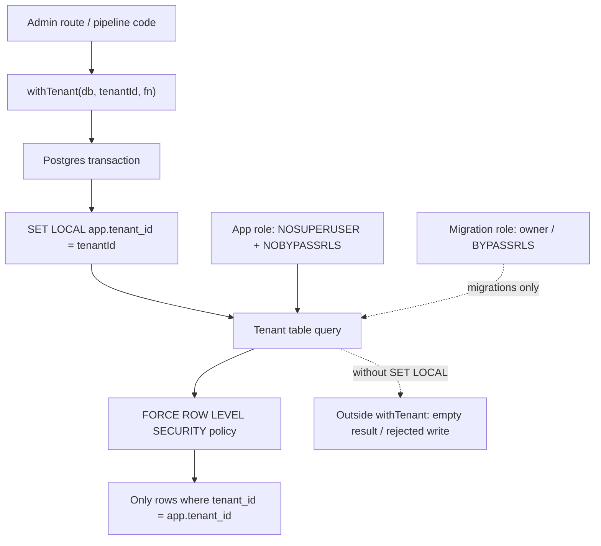
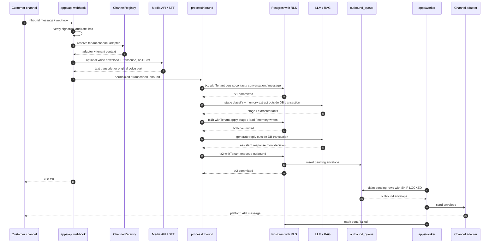
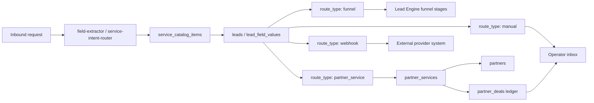

# Architecture

Детальная архитектура `lead-engine`: процессы, data flow, изоляция,
hot-reload, secrets. Для high-level introduction — см.
[`../../README.md`](../../README.md).

---

## Topology

```
                     ┌─────────────────────────────────────┐
                     │           Customer (end-user)       │
                     │  Telegram / WhatsApp / Messenger /  │
                     │  VK / MAX / Web widget              │
                     └─────────────────┬───────────────────┘
                                       │
                                       ▼
       ┌──────────────────────────────────────────────────────┐
       │  apps/api (HTTP server, Bun + Hono)                  │
       │  ┌────────────────────────────────────────────────┐  │
       │  │  /webhook/telegram/:slug      ←  Telegram       │  │
       │  │  /webhook/whatsapp/:slug      ←  Meta Cloud     │  │
       │  │  /webhook/facebook/:slug      ←  Meta Messenger │  │
       │  │  /webhook/vk/:slug            ←  VK Callback    │  │
       │  │  /webhook/max/:slug/:botId    ←  MAX Bot API    │  │
       │  │  /ws/:slug?user=X             ←  Web widget     │  │
       │  │  /api/auth/*  /api/admin/*    ←  Admin UI       │  │
       │  └────────────────────────────────────────────────┘  │
       │  In-memory:                                          │
       │   - ChannelRegistry (adapter instances, hot-reload)  │
       │   - InMemoryLlmRouter (per-tenant configs)           │
       │   - LoadedRef (mutable snapshot)                     │
       │   - InboundRateLimiter (sliding window per tenant)   │
       │   - WebChannelRegistry (WS pinned connections)       │
       └────────────────┬────────────────────────┬────────────┘
                        │ (writes)               │ (in-process WS dispatch)
                        ▼                        ▼
       ┌──────────────────────────┐    ┌──────────────────────┐
       │   Postgres (pgvector)    │◄───┤ apps/worker          │
       │                          │    │  - OutboundDispatcher │
       │  tenants                 │    │    (SKIP LOCKED)      │
       │  channels                │    │  - Telegram BotAPI    │
       │  conversations, messages │    │    outbound           │
       │  kb_documents, kb_chunks │    │  - WhatsApp / Messenger│
       │  service_catalog_items   │    │    send (Meta Graph)   │
       │  partners, partner_deals │    │  - VK messages.send    │
       │  llm_provider_configs    │    │  - MAX POST /messages  │
       │  tenant_secrets (AES-256)│    │  - Periodic channel   │
       │  outbound_queue          │    │    reload (30s poll)  │
       │  audit_log               │    │  - Cron jobs          │
       │                          │    └──────────────────────┘
       │                          │
       │  FORCE RLS on tenant data│
       └──────────────────────────┘
                        ▲
                        │ (psql / migrations as bypass-role)
                        │
       ┌──────────────────────────┐
       │  apps/admin-ui (React)   │
       │  login / accept-invite   │
       │  /onboarding (gated)     │
       │  /channels  /settings    │
       │  /leads  /funnel /catalog│
       │  /exchange (обменник)    │
       │  /conversations  /audit  │
       │  /diagnostics  /superadmin│
       │  Copilot dock (page-aware)│
       └──────────────────────────┘
```

### Visual system map



---

## Multi-tenant isolation

### Layer 1: `tenant_id` колонка

Каждая доменная таблица имеет `tenant_id` (FK на `tenants.id`, `ON DELETE
CASCADE`). Repo-методы из `packages/conversation-engine/src/dal/`
требуют `tenantId` в `RepoCtx`.

### Layer 2: `withTenant(db, tenantId, fn)`

Открывает Postgres transaction + `SET LOCAL app.tenant_id = $1`. Внутри
транзакции `current_setting('app.tenant_id')` равно `tenantId`.

### Layer 3: FORCE ROW LEVEL SECURITY

Миграция `0004_enable_rls.sql` включает RLS на tenant-scoped таблицах с policy;
последующие миграции добавляют RLS для новых tenant-таблиц (`service_catalog`,
`partner_deals`, etc.):

```sql
CREATE POLICY tenant_isolation ON conversations
  FOR ALL
  USING (tenant_id = current_setting('app.tenant_id', true)::int)
  WITH CHECK (tenant_id = current_setting('app.tenant_id', true)::int);

ALTER TABLE conversations ENABLE ROW LEVEL SECURITY;
ALTER TABLE conversations FORCE ROW LEVEL SECURITY;
```

`FORCE` важен — без него owner role пропускает policy.

### Layer 4: app connection role

`apps/api` + `apps/worker` коннектятся под **NOSUPERUSER NOBYPASSRLS**.
Если кто-то забыл и поднял app под owner-role — RLS не enforces (warning
на boot).

**Validated by** `packages/storage/src/rls.integration.test.ts` — тесты
создают role с `NOBYPASSRLS` и проверяют что вне `withTenant` запросы
видят 0 rows.

### RLS visual



---

## Pipeline

### Inbound (Telegram example)

```
1. Telegram POST /webhook/telegram/<tenantSlug>
   Header X-Telegram-Bot-Api-Secret-Token

2. apps/api (webhook-telegram.ts):
   ├─ verify header == TELEGRAM_WEBHOOK_SECRET                → 401 если нет
   ├─ ChannelRegistry.getTelegramBotsByTenant(slug)           → 404 если empty
   ├─ rateLimiter.check(tenantId)                              → 429 если over
   ├─ parse update (TgUpdate)
   ├─ adapter.pushUpdate(update)
   ├─ for await Inbound
   ├─ [opt] transcribeInboundVoice(): media download + STT, NO tx
   └─ processInbound(...)

3. processInbound (conversation-engine):
   ┌─ Phase 1: withTenant tx1 (persist) ─────────────────────┐
   │  - resolveContact (lookup или create + ChannelIdentity)  │
   │  - resolveConversation (per channel)                      │
   │  - persist Message (uniq dedup external_message_id)       │
   │  - vertical-template.extractFields() hook                 │
   └──────────────────────────────────────────────────────────┘

   ┌─ Phase 2: post-processing split ─────────────────────────┐
   │  - stageClassifier: classify outside tx                   │
   │  - memoryExtractor: read RLS snapshot in short tx,        │
   │    extract facts outside tx                               │
   │  - withTenant tx1b: apply current_stage, lead advance,    │
   │    merge contact attrs                                    │
   └──────────────────────────────────────────────────────────┘

   ┌─ Phase 3: NO tx ─────────────────────────────────────────┐
   │  - replyStrategy.generate() — ~1-2s LLM call              │
   │  - Pool connection FREE на это время (PR #14 split)       │
   └──────────────────────────────────────────────────────────┘

   ┌─ Phase 4: withTenant tx2 (enqueue) ──────────────────────┐
   │  - outbound_queue INSERT (status=pending, scheduled=now)  │
   │  - idempotencyKey предотвращает дубли                     │
   └──────────────────────────────────────────────────────────┘

   ┌─ Phase 5: async, NO tx (photo classification) ───────────┐
   │  Если inbound содержит photo-части И tenant настроил     │
   │  LLM purpose='vision':                                   │
   │  - adapter.downloadMedia(mediaRef) → bytes               │
   │  - classifyPhoto() → "passport"|"full_body"|"portrait"|  │
   │                        "other"                           │
   │  - Если "passport" → extractPassportIdentity() (OCR MRZ) │
   │    → family_name, given_name, passport_number, expiry     │
   │  - withTenant tx3: mergeAttributes в contact.attrs_json  │
   │  Fire-and-forget — НЕ блокирует webhook response.        │
   └──────────────────────────────────────────────────────────┘

4. apps/api → 200 OK (typical < 100ms если LLM/STT skipped; reply, stage,
   memory and voice add outside-tx LLM/STT latency).
```

### Outbound

```
1. apps/worker dispatcher poll'ит outbound_queue (1s default):
   SELECT id FROM outbound_queue
     WHERE status = 'pending' AND scheduled_at <= now()
     AND kind IN ('telegram_bot', 'whatsapp', 'facebook', 'vk', 'max')
     ORDER BY scheduled_at
     FOR UPDATE SKIP LOCKED
     LIMIT $batchSize

2. WorkerChannelRegistry.byChannelId(channelId) → adapter

3. adapter.send(envelope) — Telegram BotAPI, Meta Graph, VK API или MAX API

4. On success: UPDATE outbound_queue SET status='sent', external_message_id=...

5. On failure: SET status='failed', last_error=..., attempt++ (retry policy TBD)
```

**Web и Telegram userbot** — особенные: pinned WebSocket/MTProto-состояние
живёт в `apps/api`, поэтому отдельные in-process dispatchers фильтруют
`kind='web'` и `kind='telegram_userbot'`. Worker дисптачер фильтрует
`claimKinds: ['telegram_bot', 'whatsapp', 'facebook', 'vk', 'max']`, чтобы не
grab'ить rows, которые он не может отправить.

### Inbound / outbound sequence



---

## Hot-reload

Изменения через admin-UI применяются **live** без рестартов.

### apps/api in-process bus

`apps/api/src/lib/tenant-reloader.ts` экспортирует:

```ts
makeTenantReloader({ db, cfg, ref: LoadedRef, registry, log }) →
  { reloadLlm(tenantId), reloadChannels(tenantId) }
```

Routes вызывают callback после успешного PUT/POST/DELETE:

| Admin action | Hot-reload effect |
|---|---|
| `PUT /api/admin/llm-configs/:purpose` | `router.invalidate(tenantId)` + setConfig + mutate `LoadedRef.current.byTenant` |
| `DELETE /api/admin/llm-configs/:purpose` | то же — purpose удалён из snapshot'а |
| `POST /api/admin/channels/{telegram,whatsapp,facebook,vk,max,web}` | `ChannelRegistry.reloadTenant(tenantId, slug)` — close old adapter, instantiate new |
| `POST /api/admin/channels/userbot/*` | сохраняет MTProto session/creds, reloadTenant + in-process userbot dispatcher |
| `DELETE /api/admin/channels/:id` | то же |
| `PUT /api/admin/tenant/status` | reloadChannels (evict при pause, restore при resume) |

**Edge case**: `makeReplyStrategy` решает RagReplyStrategy vs
LlmReplyStrategy один раз на boot (на основе initial `anyTenantHasEmbed`).
Если tenant добавляет embed config **после** boot — RAG не активируется
до restart. Acceptable trade-off (embed добавление редкое).

### apps/worker polling

Отдельный процесс — нет shared memory с api. Polling-based:

```ts
setInterval(async () => {
  const delta = await channels.reloadAll();   // close all + load all
  if (delta.before !== delta.after) {
    log.info('worker channels reloaded', delta);
  }
}, cfg.channelReloadIntervalMs);  // default 30s
```

30 секундный lag acceptable для onboarding. `pg_notify`-based sub-second
reload — отдельный PR когда понадобится.

---

## Secrets (AES-256-GCM)

`packages/conversation-engine/src/secrets.ts`:

```ts
encryptSecret(masterKeyHex: string, plaintext: string): string
  → returns base64(iv (12 bytes) || ciphertext || authTag (16 bytes))

decryptSecret(masterKeyHex: string, ciphertext: string): string
  → throws SecretCryptoError при auth tag mismatch

setEncryptedSecret({ db, tenantId, key, value, masterKeyHex, nowEpoch })
  → INSERT ... ON CONFLICT DO UPDATE в tenant_secrets

getDecryptedSecret({ db, tenantId, key, masterKeyHex })
  → SELECT + decrypt, returns null если row отсутствует
```

`PLATFORM_MASTER_KEY` — 32 байта (64 hex chars). Ротация — отдельный
скрипт `apps/api/scripts/rotate-master-key.ts` (re-encrypts всё под
новый ключ + atomic swap).

**Что лежит зашифрованным** в `tenant_secrets`:

Каналы (per-tenant креды, с fallback на env):

- `channel_telegram_bot_<username>` — Telegram bot token
- `telegram_api_id` / `telegram_api_hash` — MTProto app credentials для
  userbot (fallback env `TELEGRAM_API_ID` / `TELEGRAM_API_HASH`,
  `apps/api/src/lib/userbot-creds.ts`)
- `channel_userbot_<phone>` — MTProto session string
- `channel_whatsapp_<phone_id>` — WhatsApp access token
- `whatsapp_verify_token` / `whatsapp_app_secret` — Meta webhook креды
  (fallback env `WHATSAPP_VERIFY_TOKEN` / `WHATSAPP_APP_SECRET`)
- `channel_facebook_<page_id>` — Messenger Page Access Token
- `facebook_verify_token` / `facebook_app_secret` — Meta webhook креды
  (fallback env `FACEBOOK_VERIFY_TOKEN` / `FACEBOOK_APP_SECRET`)
- `channel_vk_<group_id>` — VK community access token
- `vk_confirmation_code_<group_id>` / `vk_secret_key_<group_id>` — VK Callback
  API confirmation/secret values
- `channel_max_<bot_id>` — MAX bot token (fallback env
  `MAX_BOT_TOKEN_<SLUG>` / `MAX_BOT_TOKEN`)
- `channel_max_<bot_id>_webhook_secret` — MAX `X-Max-Bot-Api-Secret`
  (fallback env `MAX_WEBHOOK_SECRET`)
- web-channel секреты и snippet metadata — через `channels.metadata_json` и,
  если нужен shared auth, env `WEB_WS_AUTH_SECRET`

LLM (по purpose):

- `llm_chat_apikey` / `llm_embed_apikey` / `llm_vision_apikey`
  (photo-processor: классификация фото + OCR паспортов) /
  `llm_judge_apikey` (ELO-grading skills) / `llm_reranker_apikey` /
  `llm_transcribe_apikey`

Marketplace / партнёры:

- provider credentials должны храниться через `tenant_secrets` или
  provider-specific encrypted keys; audit/details хранят только marker metadata,
  SLA, coverage, commission and route hints.

Обменник (allowlist в `apps/api/src/lib/exchange/requisite-keys.ts`):

- `exchange_wallet_<asset>_<network>` — адреса кошельков
- фиксированные платёжные ключи (фиат payment URL, Binance ID, реквизиты карты)
- бизнес-данные: контакт оператора, методы выплат, KYC-политика, часы, адрес

---

## Per-tenant LLM routing

```
LoadedRef {
  current: LoadedLlmConfigs {                  ← mutable, mutated by reloader
    byTenant: Map<tenantId, Map<purpose, ResolvedLlmConfig>>
    anyTenantHasChat: boolean
    anyTenantHasEmbed: boolean
  }
  router: InMemoryLlmRouter                     ← shared instance
}
```

`InMemoryLlmRouter` (из `packages/llm-router`) — `setConfig({ tenantId,
purpose, provider, model, apiKey, ... })`. На `resolveChat(tenantId,
purpose)` → cached `ChatClient` (base router: OpenAI / OpenRouter / Ollama).
Purpose-specific app resolvers дополнительно читают DB-конфиги для
`reranker` (Jina/Cohere) и `transcribe` (OpenRouter/OpenAI-compatible).

`router.invalidate(tenantId)` сбрасывает все cached clients этого
tenant'а — следующий resolve пересоберёт с новым config'ом.

`llm-config-loader.loadTenantLlmConfigs()` на boot читает все
`llm_provider_configs` + decrypts apiKeys, fall back'ит на env vars
если у tenant'а нет DB row'а.

---

## Plan tiers + quota

`apps/api/src/lib/plans.ts` — source-of-truth:

| Plan | maxChannels | maxKbDocuments | rateLimitPerMinute | priceUsd |
|---|---|---|---|---|
| `free` | 100 | 100000 | 120 | 0 |
| `starter` | 3 | 500 | 60 | 99 |
| `pro` | 10 | 10000 | 120 | 199 |
| `enterprise` | 100 | 100000 | 600 | null (custom / self-host) |

> **NB**: в текущей (обменно-ориентированной / self-host) конфигурации
> базовый план `free` фактически **без лимитов** (SaaS-биллинга нет —
> `maxChannels/maxKbDocuments` заданы с большим запасом, потому что
> quota-чек не понимает `-1`). SaaS-тиры `starter $99` / `pro $199`
> существуют в коде для биллингового пути, но в self-host деплое не
> применяются. См. комментарий в `plans.ts`.

`resolvePlan(planStr)` маппит `tenants.plan` строку в `PlanLimits`.
Unknown plan → fallback на `free` с warning hook.

**Quota enforcement** — `apps/api/src/lib/quota.ts`:

- `canAddChannel({ db, tenantId })` — вызывается в `POST /api/admin/channels/*`
  на new-channel path (Telegram, userbot, WhatsApp, Facebook, VK, MAX, Web). Token
  rotation для существующего channel bypass'ит quota.
- `canAddKbDocument({ db, tenantId })` — вызывается в `POST /api/admin/kb/documents`.
  Dedup по `content_hash` работает orthogonally — same-content re-upload не
  увеличивает count.

Превышение → `402 Payment Required` со structured response:

```json
{
  "error": "quota_exceeded",
  "reason": "max_channels",
  "limit": 1,
  "current": 1,
  "plan": "free",
  "planLabel": "Free",
  "upgradeHint": "Перейдите на план Starter ($99/мес) для большего числа каналов"
}
```

---

## Service catalog + provider marketplace

Каталог услуг — tenant-scoped routing layer для бизнесов, где один бот продаёт
несколько услуг. UI: `/catalog`; API: `admin-service-catalog.ts`,
`admin-provider-marketplace.ts`, `admin-partners.ts`.

### Main tables

| Table | Purpose |
|---|---|
| `service_catalog_items` | Витрина услуг tenant'а: name/category/description + route target |
| `partners` | Исполнители/партнёры, contact data, default commission, settlement currency |
| `partner_services` | Конкретная услуга партнёра, category, stage/funnel hints, commission |
| `partner_deals` | Handoff ledger: sent/accepted/completed/cancelled/settled + gross/commission |

### Route types

| `service_catalog_items.route_type` | Target | Runtime meaning |
|---|---|---|
| `funnel` | `funnel_id` | Lead Engine ведёт заявку через обычную воронку |
| `partner_service` | `partner_service_id` | Оператор/AI передаёт заявку провайдеру, deal ledger трекает статус |
| `webhook` | `webhook_url` | Extension point для внешней provider-системы |
| `manual` | none | Оператор обрабатывает руками |

Curated provider install (`POST /api/admin/provider-marketplace/:key/install`)
идемпотентно создаёт `partner` + `partner_service` + `service_catalog_item`.
Custom provider (`POST /api/admin/provider-marketplace/custom`) делает то же,
но из данных формы. Metadata содержит `source`, `providerKey`, `coverage`,
`sla`, `pricingMode`, `requiredFields`, `handoffMode`, `installedAt`.
Runtime сначала создаёт/обновляет `lead` по заявке, а затем route target:
воронка, partner deal, webhook или manual operator queue.

Технический reference: [SERVICE_CATALOG.md](SERVICE_CATALOG.md).

### Catalog routing visual



---

## Stripe billing

`apps/api/src/lib/stripe-api.ts` — минимальный REST-wrapper над Stripe API
(без `stripe-node` dependency). Покрывает три use-case'а:

- `createCustomer({ email, tenantId, tenantSlug })` — POST `/v1/customers`
  с `metadata.tenant_id` для idempotency lookup.
- `createCheckoutSession({ customerId, priceId, tenantId, successUrl,
  cancelUrl, trialDays })` — subscription mode + `client_reference_id=tenantId`
  для webhook resolve.
- `createBillingPortalSession({ customerId, returnUrl })` — Customer
  Portal session для self-service cancel / change card.

**Endpoint flow (M1b):**

```
POST /api/admin/billing/checkout { plan: 'starter' | 'pro' }
  ↓
  1. Lookup admin.email + tenant.slug
  2. Lookup или create stripe_customers row (idempotent)
  3. createCheckoutSession (14-day trial)
  4. recordAudit billing.checkout_started
  5. Return { url, sessionId }
  ↓
client redirect → window.location.href = res.url
  ↓
Tenant платит на Stripe Checkout
  ↓
Stripe POST /webhook/stripe (HMAC-SHA256 verify)
  ↓
  customer.subscription.created/updated:
    - INSERT/UPDATE stripe_subscriptions
    - priceMap[priceId] → newPlan ('starter' | 'pro')
    - status='active'|'trialing' → tenants.plan = newPlan
  customer.subscription.deleted:
    - tenants.plan = 'free'
  ↓
Next /api/admin/channels POST → canAddChannel reads fresh tenants.plan →
quota lifted instantly без рестарта.
```

`priceToPlan` map передаётся в `makeStripeWebhookRoutes` на boot из env
(`STRIPE_PRICE_STARTER` / `STRIPE_PRICE_PRO`). Unknown priceId → warning,
`tenants.plan` не меняется.

Идемпотентность: `stripeWebhookEvents.stripe_event_id` уникальный, дубли
events возвращают `{ ok: true, deduped: true }`.

---

## Audit log

`apps/api/src/lib/audit.ts`:

```ts
recordAudit(db, {
  tenantId, adminId,
  action: 'channel.create',     // taxonomy: {entity}.{verb}
  targetKind: 'channel',
  targetId: 42,
  details: { kind: 'telegram_bot', username: '...' },  // НЕТ secret value!
});
```

Fail-quiet: ошибка audit'а не валит request. Записи живут вечно (нет TTL
сейчас — добавится когда `audit_log` row count станет проблемой).

Чтение — `GET /api/admin/audit-log?limit=N&cursor=<epoch>` (cursor по
`createdAt DESC`). CSV export — `GET /api/admin/audit-log/export.csv`.
UI рендерит JSON details collapsibly.

**Текущая taxonomy actions:**

```
auth.signup                       — tenant + admin создан
llm_config.create / update / delete
channel.create / update / delete  — telegram_bot/userbot/whatsapp/facebook/vk/max/web
conversation.reply                — operator отправил message с role='human'
conversation.mode.takeover        — mode 'ai' → 'human'
conversation.mode.return_to_ai    — mode 'human' → 'ai'
tenant.pause                      — tenant.status 'active' → 'suspended'
tenant.resume                     — tenant.status 'suspended' → 'active'
billing.checkout_started          — POST /checkout, details: { plan, priceId, customerId }
lead.send_photo                   — оператор отправил фото/QR клиенту через admin-UI
provider_marketplace.install      — curated provider installed into catalog
provider_marketplace.custom_create — custom provider + service + catalog item
service_catalog.create / update / delete
partner.create / update
partner_service.create
```

Raw secrets / tokens / apiKey НИКОГДА не попадают в `details` — verified
в integration-тестах через `expect(JSON.stringify(details)).not.toContain(rawToken)`.

---

## Rate limiting

`apps/api/src/lib/rate-limiter.ts` — `InboundRateLimiter` с sliding-window
counter per `tenantId`. Windows: 60s + 3600s.

```ts
const decision = limiter.check(tenantId);
if (!decision.allowed) {
  c.header('Retry-After', String(decision.retryAfterSec));
  return c.json({
    error: 'rate_limit_exceeded',
    reason: decision.reason,            // 'per_minute' | 'per_hour'
    retryAfterSec: decision.retryAfterSec,
  }, 429);
}
```

In-process (single instance). Restart сбрасывает state — acceptable
(attacker за restart-окно не успевает накопить полный hour-bucket).
Cross-process — Redis (TODO).

Defaults: 60 msg/min, 600 msg/hour per tenant. Configurable через env.

---

## Database migrations

`packages/storage/migrations/`:

```
0000_init_full_schema.sql          — Drizzle generated baseline
0001_multi_tenant.sql              — tenants, tenant_secrets, channels, ...
0002_tenant_id_existing_tables.sql — add tenant_id to legacy 28 tables
0003_backfill_users_to_contacts.sql— users → contacts data migration
0004_enable_rls.sql                — FORCE ROW LEVEL SECURITY
0005_outbound_processing_status.sql— status enum + processing intent
0006_stripe_billing.sql            — stripe_customers, stripe_subscriptions
0007_conversations_to_contacts_fk.sql — FK swap users → contacts
0008_drop_users.sql                — drop legacy users table
0009_admin_invites.sql             — invite-flow (закрытая регистрация)
0010_llm_usage_events.sql          — учёт LLM-вызовов / billing usage
0011_universal_pipeline.sql        — stage_definitions / stage_fields / lead_field_values
0012_director_hooks.sql            — hooks (инъекции в промпт)
0013_referral_codes.sql            — реферальные коды
0014_stage_webhooks.sql            — вебхуки на смену стадии
0015_reranker_provider.sql         — purpose='reranker'
0017_message_templates.sql         — шаблоны сообщений
0018_password_resets.sql           — forgot/reset password
0019_notifications.sql             — правила уведомлений оператора
0020_notification_group_tokens.sql — групповые токены уведомлений
0021_skills_tenant_slug_unique.sql — uniq skills per tenant
0022_exchange.sql                  — exchange_rates / exchange_orders
0023_universal_stage_types.sql     — расширённый каталог STAGE_TYPES
0024_conversation_inbox_fields.sql — поля оператор-инбокса
0025_exchange_rate_tiers.sql       — approved rate tiers
0026_exchange_order_methods.sql    — платёжные рельсы заказа
0027_stage_fields_video_constraint.sql — fieldType='video'
0028_stage_definitions_type_constraint.sql — CHECK STAGE_TYPES
0029_llm_transcribe_purpose.sql    — purpose='transcribe'
0030_admins_name.sql               — admins.name
0031_stage_phase.sql               — stage_definitions.phase (костяк воронки)
0032_leads_request_type.sql        — concierge/multi-request leads.request_type
0033_channels_facebook_kind.sql    — channels.kind='facebook'
0034_stage_goal_guidance.sql       — per-stage goal/guidance for runtime prompts
0035_exchange_settings.sql         — exchange tenant settings
0036_admin_informer.sql            — admin/operator informer
0037_informer_quiet_hours.sql      — quiet hours for informer
0038_exchange_payout_code_ttl.sql  — payout code TTL
0039_outreach_campaigns.sql        — outreach campaign tables
0040_stage_partner_webhook.sql     — stage partner webhook routing
0041_partner_billing.sql           — partners, partner_services, partner_deals
0042_service_catalog.sql           — service_catalog_items
0043_exchange_remove_intent_stage.sql — cleanup legacy exchange/concierge stage
0044_channels_vk_kind.sql          — channels.kind='vk'
0044_early_access_signups.sql      — public early access waitlist
0045_channels_max_kind.sql         — channels.kind='max'
0045_provider_relay.sql            — provider_profiles / provider_services / service_orders / provider_requests / order_events
0046_agent_tool_calls.sql          — agent_tool_calls (tool-loop traces)
0047_agent_tool_call_feedback.sql  — human labels на tool calls
0048_kb_scopes.sql                 — KB scoping по funnel/stage
0049_kb_document_files.sql         — метаданные оригиналов KB-загрузок
0049_provider_payment_ledger.sql   — service_order_payments + commission ledger
0050_shadow_eval_queue.sql         — durable queue для shadow evaluations
0051_agent_tool_call_improvement_proposals.sql — improvement proposals по tool calls
0051_funnel_versions.sql           — funnel_versions (версионирование воронок)
0052_operator_action_drafts.sql    — durable preview/action state operator-бота
0052_tool_call_improvement_resolution.sql — resolution-поля у proposals
0053_tool_call_regression_cases.sql — agent_tool_call_regression_cases
0054_conversation_channel_id.sql   — conversations.channel_id (first-class FK)
0055_provider_request_failed_status.sql — provider_requests status='failed'
0056_tenant_feature_flags.sql      — tenant_feature_flags (gated rollout, напр. provider_relay)
```

(Файл `0016` отсутствует намеренно — номер пропущен. Номера `0044`, `0045`,
`0049`, `0051` и `0052` использованы двумя независимыми файлами каждый.)
Migrations run
раздельно от app process под superuser/owner role. Apps запускаются под
`NOSUPERUSER NOBYPASSRLS`.

---

## Observability

`@chatman-media/observability`:

- **`PlatformMetrics`** — Counter / Histogram registry. Prometheus
  exposition через `GET /metrics` (apps/api) + `:9100/metrics` (apps/worker
  если `METRICS_PORT` задан).
- **`JsonLogger`** — структурированные JSON logs (`info` / `warn` / `error`)
  с `app`, `ts`, `event`, `tenantId` контекстом.
- **`makeMetricsSink`** — emits pipeline events (`inbound_received`,
  `inbound_persisted`, `inbound_deduped`, `reply_generated`,
  `outbound_enqueued`, `outbound_sent`) с tenantId label'ом.

Key metrics:

```
lead_engine_webhook_requests_total{channel, status}   — webhook hit count
lead_engine_webhook_latency_seconds{channel}          — handler duration
lead_engine_inbound_received_total{tenant, channel}   — pipeline ingress
lead_engine_inbound_deduped_total{tenant}             — duplicate detection
lead_engine_reply_generated_total{tenant, kind}       — RAG vs LLM-only
lead_engine_outbound_sent_total{tenant, channel}      — успешные send'ы
lead_engine_outbound_failed_total{tenant, channel, kind} — failures по kind
lead_engine_llm_calls_total{provider, purpose}        — token-cost proxy
lead_engine_llm_errors_total{provider, purpose, kind} — error rates
```

---

## Where things live

| Concept | File |
|---|---|
| Auth (JWT-like HMAC-SHA256 tokens) | `apps/api/src/lib/auth.ts` |
| Require-auth middleware | `apps/api/src/middleware/require-auth.ts` |
| Channel registry (api) | `apps/api/src/channel-registry.ts` |
| Channel registry (worker) | `apps/worker/src/channel-registry.ts` |
| Channel adapter contract | `packages/channel-core/src/types.ts` + `packages/channel-core/src/adapter.ts` |
| Telegram adapter | `packages/channel-telegram` |
| WhatsApp adapter | `packages/channel-whatsapp` |
| Facebook Messenger adapter | `packages/channel-facebook` |
| VK adapter | `packages/channel-vk` |
| MAX adapter | `packages/channel-max` |
| Web adapter | `packages/channel-web` |
| LLM bootstrap (factories) | `apps/api/src/llm-bootstrap.ts` |
| LLM config loader | `apps/api/src/lib/llm-config-loader.ts` |
| Tenant reloader (hot-reload bus) | `apps/api/src/lib/tenant-reloader.ts` |
| Audit helper | `apps/api/src/lib/audit.ts` |
| AI Workflow Builder (ai-chat + apply) | `apps/api/src/routes/admin-workflow.ts` |
| Photo classifier + passport OCR | `apps/api/src/lib/photo-processor.ts` |
| Rate limiter | `apps/api/src/lib/rate-limiter.ts` |
| Plan tiers (PlanLimits) | `apps/api/src/lib/plans.ts` |
| Quota helpers | `apps/api/src/lib/quota.ts` |
| Service catalog routes | `apps/api/src/routes/admin-service-catalog.ts` |
| Provider marketplace routes/data | `apps/api/src/routes/admin-provider-marketplace.ts` + `apps/api/src/lib/provider-marketplace.ts` |
| Partners / partner deals | `apps/api/src/routes/admin-partners.ts` |
| Stripe API wrapper | `apps/api/src/lib/stripe-api.ts` |
| Stripe signature verification | `apps/api/src/lib/stripe-signature.ts` |
| Secrets (AES-256-GCM) | `packages/conversation-engine/src/secrets.ts` |
| withTenant wrapper | `packages/conversation-engine/src/with-tenant.ts` |
| RLS check | `packages/conversation-engine/src/rls-check.ts` |
| Pipeline (processInbound) | `packages/conversation-engine/src/process-inbound.ts` |
| Reply strategies | `packages/conversation-engine/src/{llm,rag}-reply-strategy.ts` |
| RAG core | `packages/kb/src/answer.ts` + `hybrid-search.ts` |
| Funnel phase backbone | `packages/verticals/src/phases.ts` |
| Onboarding status + gate | `apps/api/src/routes/admin-onboarding.ts` + `apps/admin-ui/src/pages/SaasOnboarding.tsx` |
| Userbot creds (per-tenant) | `apps/api/src/lib/userbot-creds.ts` |
| Exchange rates / guardrails | `apps/api/src/lib/exchange/{rates,guardrails}.ts` |
| Exchange requisite keys | `apps/api/src/lib/exchange/requisite-keys.ts` |
| Ops-watch sweeper (alerts) | `apps/worker/src/ops-watch-sweep.ts` |
| Admin copilot | `apps/api/src/routes/admin-copilot.ts` |
| Drizzle schema | `packages/storage/src/schema.ts` |

---

## Universal lead pipeline

Стадии лида хранятся в БД (`stage_definitions` / `stage_fields`) и
настраиваются из admin-UI без деплоя. Каждый тенант создаёт свою воронку
с произвольным набором стадий.

### Ключевые таблицы

| Таблица | Назначение |
|---|---|
| `stage_definitions` | Стадии воронки: slug, `kind` (`intake`/`active`/`terminal_won`/`terminal_lost`), `phase` (костяк — у активных стадий), тип (`form_fill`, `document_upload`, `document_signature`, `rate_confirmation`, `external_approval`, `payment`, `awaiting_operator`, `interaction`, `assessment`, `waiting`, `milestone`), позиция, timeout |
| `stage_fields` | Поля данных на стадии: тип (`text`, `textarea`, `number`, `date`, `select`, `multiselect`, `boolean`, `phone`, `email`, `photo`, `file`, `video`), `required`, `ai_extractable` |
| `lead_field_values` | Значения полей для конкретного лида (upsert по `(lead_id, field_id)`) |
| `leads` | Лид с `stage_definition_id` FK; `state` text-колонка сохранена для backward compatibility с вертикалью recruitment-UAE |

### Типы стадий

| Тип | Что происходит |
|---|---|
| `form_fill` | Бот/оператор собирает данные через `stage_fields` |
| `document_upload` | Кандидат присылает файлы |
| `document_signature` | Подписание договора |
| `rate_confirmation` | Бот показывает курс/цену, ждёт подтверждения |
| `external_approval` | Ждём решения третьей стороны (webhook) |
| `payment` | Оплата |
| `waiting` | Ждём по таймауту |
| `awaiting_operator` | `supportMode=true` — бот замолкает, оператор действует вручную |
| `interaction` | Встреча/звонок/просмотр |
| `assessment` | Оценка/квалификация |
| `milestone` | Контрольная точка |

### Funnel phase backbone (костяк)

Стадии у каждой вертикали свои, но поверх них лежит **универсальная ось
фаз** — общий семантический слой для cross-vertical аналитики, AI-сборки и
валидации (`packages/verticals/src/phases.ts`, миграция `0031_stage_phase.sql`):

```
capture → qualify → offer → [clear] → [fulfill] → won / lost
```

| Фаза | Что значит | Источник |
|---|---|---|
| `capture` | первый контакт, сырой интент | derived из `kind='intake'` |
| `qualify` | понять потребность + оценить качество сделки | `phase` колонка |
| `offer` | предложить условия (цена/курс/scope) + согласие | `phase` колонка |
| `clear` | гейты: KYC, комплаенс, документы, 3-rd party | `phase` колонка (опц.) |
| `fulfill` | доставка ценности + оплата | `phase` колонка (опц.) |
| `won` / `lost` | терминальные | derived из `kind` |

- В БД у активных стадий хранится `stage_definitions.phase` ∈
  `qualify | offer | clear | fulfill` (CHECK-констрейнт); якоря выводятся
  из `kind`. `effectivePhase(stage)` объединяет оба источника.
- `qualify` и `offer` обязательны; `clear`/`fulfill` опциональны.
- `validateBackbone()` проверяет: ровно один intake, ≥1 terminal_won/lost,
  уникальные slug'и, валидные `nextStages`, **монотонность фаз** (активные
  стадии по позиции не идут «назад» по фазе), наличие qualify/offer.
- `deriveDefaultPhase()` / `buildSkeletonFunnel()` дают эвристику и минимальный
  валидный костяк для кастомных/AI-воронок.
- `GET /api/admin/funnel/phase-stats` — число лидов по фазам (vertical-agnostic).

Маппинг стадий на фазы по всем 9 вертикалям — см. [`VERTICALS.md`](../strategy/VERTICALS.md).

**UI vs backend:** фазы — backend-слой (валидация костяка + cross-vertical аналитика);
в кабинете оператор видит `displayName`/`kind` стадий, а не фазы. **Одна активная воронка
на тенант** (`funnels.is_active`): смена вертикали или повторный apply (включая AI-сборку)
**замещает** стадии — старые удаляются, версионирования/отката пока нет (в роадмапе).
Мульти-тип в одной вертикали — через `request_type`-ветвление (concierge-модель), а не
несколько активных воронок. AI-сборка воронки — [`AI_FUNNEL_BUILDER.md`](AI_FUNNEL_BUILDER.md).

### Photo + passport fields

Поля с `fieldType='photo'` и `aiExtractable=true` предназначены для
автоматического заполнения через vision-pipeline (Phase 4 в pipeline выше).
Когда кандидат присылает фото паспорта — `classifyPhoto()` + `extractPassportIdentity()`
OCR'ят MRZ и заполняют `contact.attributes_json` с ключами
`passport_family_name`, `passport_given_name`, `passport_number`, `passport_expiry`.

**Активация**: добавить LLM config с `purpose='vision'` (openai или openrouter,
любая vision-capable модель — `gpt-4o`, `google/gemini-2.5-flash`).

### AI Workflow Builder

`POST /api/admin/workflows/ai-chat` — многоходовой диалог оператора с AI
(до 60 ходов). AI задаёт уточняющие вопросы и когда собрал достаточно —
возвращает `readyToGenerate: true` + `preview` (список стадий с полями) + `stages` (raw).
Выбирает только из каталога `STAGE_TYPES` / `FIELD_TYPES` (экспортируются из `admin-funnel.ts`).

`POST /api/admin/workflows/apply` — применяет `stages` к тенанту:
сначала `validateBackbone(stages)` (костяк фаз — см. выше); при нарушениях
`400` со списком `violations`. Иначе удаляет текущие стадии → создаёт новые
через `applyFunnelStages()`. Использует tenant's LLM client
(`resolveChat(tenantId, "chat")`). Сам промпт инструктирует AI проставлять
`phase`, держать `qualify`/`offer` и не регрессировать по фазам.

Системный промпт кэшируется на Anthropic API (prompt caching) — длинный диалог
экономит токены. Frontend: `AiWorkflowPanel` — Sheet с чатом, preview и кнопкой "Применить".

### QR / photo delivery (send-photo endpoint)

`POST /api/admin/leads/:id/send-photo { photoRef, caption? }` — оператор
отправляет фото клиенту лида в его активный канал. `photoRef` — Telegram file_id
или публичный HTTPS URL. Ставит `outbound_queue` запись с `kind="photo"`.
Основной кейс: оператор обменника загружает cardless-withdrawal QR и пересылает
его клиенту через admin-UI (путь Б доставки QR).

---

## Onboarding & access gate

Регистрация **закрыта по умолчанию**: `POST /api/auth/signup` → `403`, пока
`allowSignup` (env `ALLOW_PUBLIC_SIGNUP=1`) не включён; tenant'ы заводятся
invite-flow'ом. После логина `OnboardingGate` (`apps/admin-ui/src/App.tsx`)
читает `GET /api/admin/onboarding-status` и держит юзера на `/onboarding`,
пока `done=false` (fail-open при ошибке status).

Визард — динамическая vertical-aware step-машина (`SaasOnboarding.tsx`):
`vertical → channel → LLM → (обменник: rates → requisites → rate-card) → KB →
(обменник: business data) → done`. Условие `done`:

```
done = channelConnected && chatLlmConfigured && (!isExchange || (funnelInstalled && activeRateCount>=1 && requisiteCount>=1))
```

Сайдбар vertical-aware (`app-shell.tsx`): по `isExchange` показывает/скрывает
пункты меню. Полный путь — [`ONBOARDING.md`](ONBOARDING.md).

---

## Exchange vertical

> Полное описание — [EXCHANGE.md](EXCHANGE.md). Здесь — краткая сводка.

Крипто/нал обменник (`exchange_v1`) — основная live-вертикаль. 11-стадийная
воронка (`apps/vertical-exchange/src/funnel-stages.ts`):
`exchange_request → quote_calculated → verification_check →
kyc_collection → risk_review → order_created → requisites_sent →
payment_proof_waiting → payment_verified → payout_or_completion / cancelled`.

### Курсы и котировки

- `exchange_rates` — базовый курс на asset+network: маржа %, фикс-комиссия,
  мин/макс, авто-обновление с фида. `exchange_rate_tiers` — approved объёмные
  ступени (`display_rate` для клиента + `market_rate` референс).
- `computeQuote()` (`apps/api/src/lib/exchange/rates.ts`): coins — режим
  «multiply» (THB за 1 asset), фиат — «divide». Тиры перекрывают базовый курс
  в своём диапазоне.

### Guardrails + ops-watch

- **Guardrails** (`apps/api/src/lib/exchange/guardrails.ts`): синхронный
  `checkRateGuard()` — отклонение эффективного курса от базового >
  `maxDeviationPct` (дефолт 35%) отклоняет котировку (ловит опечатки тарифа и
  мусор из фида). Применяется и к tier `display_rate`.
- **Ops-watch** (`apps/worker/src/ops-watch-sweep.ts`): периодический sweeper
  ловит `rate_feed_stale`, `order_stuck`, `channel_down`, `volume_spike` →
  `OpsAlert` владельцу с дедупом и cooldown'ом (`OPS_ALERT_COOLDOWN_MIN`).

### Реквизиты

Шифрованные `tenant_secrets` через allowlist
`apps/api/src/lib/exchange/requisite-keys.ts`: кошельки `exchange_wallet_*`,
фиксированные платёжные ключи (фиат URL, Binance ID, карта) и бизнес-данные
(контакт оператора, методы выплат, KYC-политика, часы, адрес). Эндпоинты —
`/api/admin/exchange/{rates,rate-card,requisites,orders}`.

---

## Admin copilot

> Полное описание — [COPILOT.md](COPILOT.md). Здесь — краткая сводка.

Page-aware AI-ассистент в кабинете (`apps/admin-ui/src/components/copilot/`,
backend `apps/api/src/routes/admin-copilot.ts`). BYOK (tenant's chat-LLM;
`503 llm_not_configured` если не настроен). Появляется на **всех** страницах
кабинета (Cmd/Ctrl+J), знает текущую страницу (route + видимый контент) через
`PAGE_HINTS`.

`POST /api/admin/copilot/chat` → LLM возвращает JSON `{ reply, action? }`, где
`action` — предложение (`install_vertical` / `build_funnel` / `navigate`),
проверяемое по allowlist. Действие применяется **только после подтверждения**
пользователем (advice + confirm), вызывая существующие эндпоинты.

---

## What's deliberately NOT done

- **Per-tenant Postgres** — одна БД, `tenant_id` колонка. До ~100 tenant'ов
  одной инстанции pgvector хватит. Sharding — когда понадобится.
- **Event sourcing / CQRS** — append-only `messages` + обычные CRUD'ы
  достаточно. Lossless audit через `audit_log`.
- **Custom domains per tenant** — subdomain `*.leadengine.app` достаточно.
- **Real-time WS feed для conversations** — 5s auto-poll проще, latency
  acceptable для operator inbox.
- **Multi-region / globally distributed** — single PG instance до 50+
  tenants. Region-pinned deployment когда GDPR требует.

См. `docs/ROADMAP.md` — что отложено намеренно vs что в очереди.
